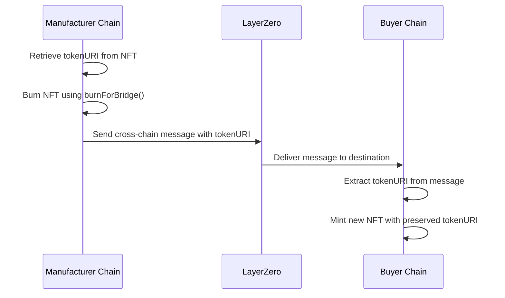

# ChainFLIP - A Multi-Chain Supply Chain Management System

<p align="center">
  
  
  
  
  
  
</p>

## 🌟 Overview

🎥 **Demo Video**: [Watch the demo on YouTube](https://www.youtube.com/watch?v=WTfmBqlDRUc)

ChainFLIP is a comprehensive **multi-chain supply chain management system** that leverages blockchain technology, NFTs, and cross-chain messaging to provide transparent, secure, and efficient product tracking from manufacturing to final delivery. The system integrates multiple blockchain networks using LayerZero protocol and implements advanced features like federated learning, dispute resolution, and post-supply chain marketplace.

### 🎯 Key Innovations

- **Multi-Chain Architecture**: Seamless integration across Base Sepolia, Optimism Sepolia, Arbitrum Sepolia, and Polygon Amoy
- **NFT-Based Product Tracking**: Each product is represented as an ERC-721 NFT with IPFS metadata
- **Cross-Chain TokenURI Preservation**: Maintains product authenticity during chain transfers using LayerZero V2
- **Federated Learning Integration**: Privacy-preserving machine learning for supply chain optimization
- **Advanced Consensus Mechanisms**: Dispute resolution and voting systems for stakeholder governance
- **Real-Time Delivery Tracking**: GPS-based location updates and delivery confirmation
- **Post-Supply Chain Marketplace**: Secondary market for authenticated products

## 🏗️ System Architecture

### 🔗 Multi-Chain Infrastructure

```
┌─────────────────┐    ┌──────────────────┐    ┌─────────────────┐
│   Base Sepolia  │    │  Optimism Sepolia │    │ Arbitrum Sepolia│
│  (Manufacturer) │◄──►│     (Buyer)       │◄──►│  (Transporter)  │
└─────────────────┘    └──────────────────┘    └─────────────────┘
         │                       │                       │
         └───────────────────────┼───────────────────────┘
                                 │
                    ┌──────────────────┐
                    │  Polygon Amoy    │
                    │ (Hub/Registry)   │
                    └──────────────────┘
```

### 📋 Tech Stack

**Blockchain Layer:**
- **Smart Contracts**: Solidity 0.8.22+, OpenZeppelin, LayerZero V2
- **Networks**: Base Sepolia, Optimism Sepolia, Arbitrum Sepolia, Polygon Amoy
- **Development**: Hardhat, Ethers.js 6.14.3

**Backend:**
- **Framework**: FastAPI (Python)
- **Database**: MongoDB with Motor (async driver)
- **Blockchain Integration**: Web3.py, custom blockchain services
- **Storage**: IPFS for metadata and documents

**Frontend:**
- **Framework**: React.js with modern hooks
- **Styling**: Tailwind CSS
- **State Management**: Context API
- **Routing**: React Router v6

**Infrastructure:**
- **Cross-Chain**: LayerZero V2 messaging protocol
- **File Storage**: IPFS with W3Storage integration
- **Deployment**: Docker support, environment-based configuration

## 🚀 Getting Started

### Prerequisites

- Node.js 16+ and npm/yarn
- Python 3.8+
- MongoDB instance
- Git

### 📦 Installation

1. **Clone the Repository**
```bash
git clone <repository-url>
cd SCM_Multichain
```

2. **Backend Setup**
```bash
cd multichain-chainflip/backend

# Install Python dependencies
pip install -r requirements.txt

# Set up environment variables
cp .env.example .env
# Edit .env with your configuration
```

3. **Smart Contracts Setup**
```bash
cd ../src

# Install dependencies
npm install

# Compile contracts
npx hardhat compile

# Deploy contracts (configure networks in hardhat.config.js)
npm run deploy
```

4. **Frontend Setup**
```bash
cd ../frontend

# Install dependencies
npm install

# Set up environment
cp .env.example .env
# Configure REACT_APP_BACKEND_URL and other variables

# Start development server
npm start
```

5. **Start Backend Server**
```bash
cd ../backend

# Activate virtual environment (Windows)
.\venv\Scripts\Activate.ps1

# Start FastAPI server with uvicorn
python -m uvicorn main:app --host 0.0.0.0 --port 8001 --reload
```

6. **Start Frontend Development Server**
```bash
cd ../frontend

# Start React development server
npm start
```

### ⚡ Quick Start

After completing the installation steps above, you can start both services:

**Terminal 1 (Backend):**
```bash
cd multichain-chainflip/backend
.\venv\Scripts\Activate.ps1
python -m uvicorn main:app --host 0.0.0.0 --port 8001 --reload
```

**Terminal 2 (Frontend):**
```bash
cd multichain-chainflip/frontend
npm start
```

The system will be available at:
- **Frontend**: http://localhost:3000
- **Backend API**: http://localhost:8001
- **API Documentation**: http://localhost:8001/docs

### 🔧 Environment Configuration

**Backend (.env):**
```bash
MONGO_URL=mongodb://localhost:27017
DB_NAME=chainflip_multichain
SECRET_KEY=your-secret-key

# Blockchain Configuration
PRIVATE_KEYS=your-private-keys-comma-separated
BASE_SEPOLIA_RPC=https://sepolia.base.org
OPTIMISM_SEPOLIA_RPC=https://sepolia.optimism.io
ARBITRUM_SEPOLIA_RPC=https://sepolia-rollup.arbitrum.io/rpc
POLYGON_AMOY_RPC=https://polygon-amoy.drpc.org

# IPFS Configuration
W3_STORAGE_TOKEN=your-w3storage-token
```

**Frontend (.env):**
```bash
REACT_APP_BACKEND_URL=http://localhost:8001
REACT_APP_ENABLE_MOCK=false
```

## 🎭 User Roles & Features

### 👨‍🏭 Manufacturer
- **Product Creation**: Mint NFTs for products with IPFS metadata
- **Quality Control**: Set product specifications and authenticity markers
- **Cross-Chain Distribution**: Transfer products to different blockchain networks
- **Payment Management**: Receive payments through escrow system

### 🚚 Transporter
- **Delivery Management**: Accept and track shipment requests
- **Real-Time Tracking**: Update GPS coordinates during transport
- **Reputation System**: Build trust through successful deliveries
- **Incentive Program**: Earn rewards for timely and quality service

### 🛒 Buyer
- **Product Discovery**: Browse authenticated products across chains
- **Purchase Process**: Secure cross-chain purchasing with escrow
- **Delivery Tracking**: Real-time visibility into shipment status
- **Receipt Confirmation**: Confirm delivery and trigger payment release
- **Post-Purchase**: Access to secondary marketplace

### 👨‍💼 Admin
- **Network Monitoring**: Oversee multi-chain operations
- **Participant Management**: Approve and manage system participants
- **Dispute Resolution**: Facilitate conflict resolution through voting
- **Analytics Dashboard**: Monitor system performance and metrics

## 🔄 Core Workflows

### 🏭 Product Lifecycle

1. **Manufacturing Phase**
   - Manufacturer creates product and mints NFT on Base Sepolia
   - Product metadata stored on IPFS with authenticity markers
   - Cross-chain CID sync to Polygon Amoy hub registry

2. **Purchase Initiation**
   - Buyer discovers product and initiates cross-chain purchase
   - Escrow created to hold buyer's payment
   - Product ownership prepared for transfer

3. **Shipping Phase**
   - Transporter accepts delivery request
   - Real-time GPS tracking with blockchain updates
   - Automated notifications to all stakeholders

4. **Delivery Completion**
   - Buyer confirms receipt through multi-step verification
   - NFT transferred to buyer with TokenURI preservation
   - Escrow released to manufacturer
   - Transporter receives delivery incentives

5. **Post-Supply Chain**
   - Product available in secondary marketplace
   - Complete supply chain history maintained
   - Authenticity verification available for resale

### 🔐 Cross-Chain NFT Transfer Process



## 🛠️ Advanced Features

### 🤖 Federated Learning System
- **Privacy-Preserving**: Train ML models without sharing raw data
- **Supply Chain Optimization**: Predict delivery times and optimize routes
- **Quality Prediction**: Forecast potential quality issues
- **Collaborative Intelligence**: Shared learning across network participants

### ⚖️ Dispute Resolution & Consensus
- **Voting Mechanism**: Stakeholder-driven dispute resolution
- **Arbitrator Network**: Qualified arbitrators for complex disputes
- **Consensus Algorithms**: Advanced consensus for critical decisions
- **Transparent Process**: All dispute resolutions recorded on-chain

### 🎯 Enhanced Authenticity Verification
- **Multi-Layer Verification**: Physical and digital authenticity checks
- **Batch Processing**: Verify up to 50 products simultaneously
- **Machine Learning**: AI-powered authenticity scoring
- **Historical Analysis**: Track authenticity trends and patterns

### 💰 Payment & Incentive System
- **Escrow Management**: Secure payment holding until delivery
- **Automated Release**: Smart contract-based payment release
- **Transporter Incentives**: Performance-based reward system
- **Platform Analytics**: Financial insights and reporting

### 🛒 Post-Supply Chain Marketplace
- **Secondary Sales**: Authenticated product resale platform
- **Ownership Transfer**: Secure transfer of product ownership
- **Valuation System**: AI-driven product valuation
- **Market Analytics**: Price trends and demand analysis

## 📊 API Documentation

### 🔌 Core Endpoints

**Authentication:**
- `POST /api/auth/login` - User authentication
- `POST /api/auth/register` - User registration
- `GET /api/auth/profile` - User profile information

**Product Management:**
- `GET /api/products/` - Retrieve products with filtering
- `POST /api/blockchain/products/mint` - Mint new product NFT
- `GET /api/products/{product_id}` - Get specific product details

**Cross-Chain Operations:**
- `POST /api/token-bridge/transfer` - Cross-chain token transfer
- `POST /api/layerzero-oft/transfer` - LayerZero OFT transfer
- `GET /api/blockchain/network-status` - Multi-chain network status

**Delivery Management:**
- `POST /api/shipping/initiate` - Start shipping process
- `PUT /api/shipping/location` - Update transporter location
- `POST /api/blockchain/delivery/buyer/confirm-receipt` - Confirm delivery

**Analytics & Monitoring:**
- `GET /api/analytics/supply-chain` - Supply chain metrics
- `GET /api/analytics/payments` - Payment system analytics
- `GET /api/federated-learning/model-status` - FL model status

### 🔍 Health Monitoring

- `GET /api/health` - Comprehensive system health check
- `GET /api/network-status` - Multi-chain network status
- `GET /api/status` - Service status monitoring

## 🔐 Security Features

### 🛡️ Smart Contract Security
- **Access Control**: Role-based permissions using OpenZeppelin
- **Pause Mechanism**: Emergency stop functionality
- **Reentrancy Protection**: Standard security patterns
- **Audit-Ready**: Clean, well-documented contract code

### 🔒 Backend Security
- **JWT Authentication**: Secure token-based authentication
- **Role-Based Access**: Granular permission system
- **Input Validation**: Comprehensive request validation
- **Rate Limiting**: API endpoint protection

### 🌐 Network Security
- **HTTPS Enforcement**: All communications encrypted
- **CORS Configuration**: Proper cross-origin resource sharing
- **Environment Isolation**: Separate configurations for different environments

## 📈 Testing & Quality Assurance

### ✅ Test Coverage

The system includes comprehensive testing across all components:

- **Smart Contracts**: Unit tests for all contract functions
- **Backend APIs**: Integration tests for all endpoints
- **Cross-Chain**: End-to-end cross-chain transfer tests
- **Frontend**: Component and integration testing

### 🧪 Test Results Summary

Based on the latest test results:
- ✅ All 5 core algorithms functional
- ✅ Cross-chain CID sync working
- ✅ Payment and incentive system operational
- ✅ Dispute resolution mechanisms active
- ✅ Enhanced authenticity verification complete
- ✅ Post-supply chain marketplace ready

## 🚀 Deployment

### 🐳 Docker Deployment

```bash
# Build and run with Docker Compose
docker-compose up -d

# Or build individual services
docker build -t chainflip-backend ./backend
docker build -t chainflip-frontend ./frontend
```

### ☁️ Cloud Deployment

The system supports deployment on major cloud platforms:
- **AWS**: EC2, RDS, S3 integration
- **Google Cloud**: Compute Engine, Cloud Storage
- **Azure**: Virtual Machines, Blob Storage

### 🌍 Network Deployment

Smart contracts are deployed on testnets:
- **Base Sepolia**: Manufacturer operations
- **Optimism Sepolia**: Buyer operations  
- **Arbitrum Sepolia**: Transporter operations
- **Polygon Amoy**: Hub and registry

## 🤝 Contributing

### 📋 Development Guidelines

1. **Code Style**: Follow established patterns in the codebase
2. **Testing**: Add tests for new features
3. **Documentation**: Update documentation for API changes
4. **Security**: Follow security best practices

### 🔄 Pull Request Process

1. Fork the repository
2. Create a feature branch
3. Implement changes with tests
4. Submit pull request with description
5. Code review and approval process

## 📞 Support & Documentation

### 📚 Additional Resources

- **Smart Contract ABIs**: Located in `/src/deployments/`
- **API Documentation**: Interactive docs at `/docs` endpoint
- **Frontend Components**: Modular React components in `/frontend/src/components/`
- **Backend Services**: Microservice architecture in `/backend/app/services/`

### 🐛 Issue Reporting

Please report issues through the GitHub issue tracker with:
- Detailed description of the problem
- Steps to reproduce
- Expected vs actual behavior
- Environment information

## 📄 License

This project is licensed under the MIT License - see the [LICENSE](LICENSE) file for details.

## 🙏 Acknowledgments

- **LayerZero**: Cross-chain messaging infrastructure
- **OpenZeppelin**: Secure smart contract libraries
- **IPFS**: Decentralized storage solution
- **FastAPI**: High-performance Python web framework
- **React**: Modern frontend development framework

---

<p align="center">
  <b>ChainFLIP Multi-Chain Supply Chain Management System</b><br>
  BLOCKCHAIN RESEARCH TEAM - UIT
</p> 